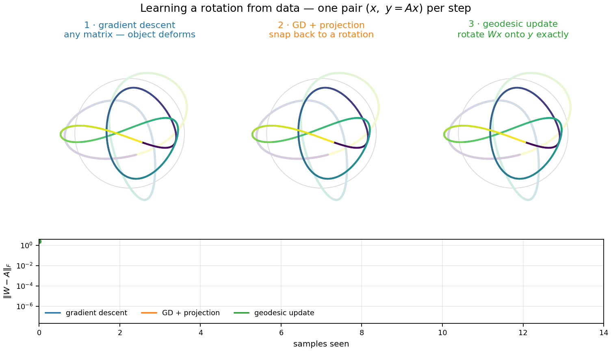
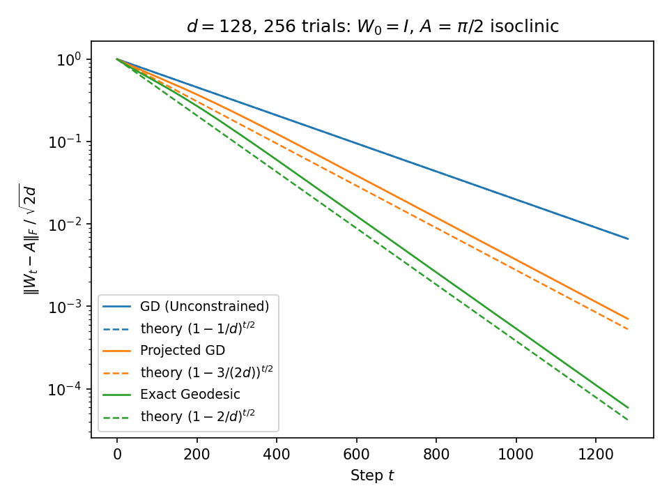

# Learning Rotations Online

An unknown rotation $A \in SO(d)$ is observed through a stream of pairs $(x, y = Ax)$. Customizing update to take into account knowledge of $A$ improves convergence. 



## Three ways to insert information

### 1. Gradient descent

```math
W \leftarrow W + (y - Wx) x^\top
```

The smallest change to $W$ that makes $Wx = y$ — a Kaczmarz step. Equivalent to an SGD step with greedy per-step line search. Each step decimates the error in one random dimension. Number of dimensions is $d$ hence loss contracts $1 - 1/d$ per step.

### 2. Gradient descent + projection

```math
W \leftarrow \mathrm{polar} \left( W + (y - Wx) x^\top \right)
```

Kazcmarz step, then project to nearest rotation matrix.

### 3. A native update for rotations

```math
W \leftarrow R W, \qquad R = I + K + \frac{K^2}{1 + c}, \qquad K = y u^\top - u y^\top, \quad u = Wx, \quad c = u \cdot y
```

$R$ is the geodesic rotation carrying $Wx$ exactly onto $y$: the full angle, never leaving $SO(d)$. Detailed derivation [doc](docs/geodesic_update.md).

## Result

| Update | Uses | Contraction of $\mathbb{E} \Vert W - A \Vert_F^2$ |
|---|---|---|
| Gradient descent | nothing | $1 - 1/d$, exact |
| GD + projection | additive update, project to SO(d) | $1 - 3/(2d)$ |
| Geodesic | multiplicative update maintaining SO(d) | $1 - 2/d$ |




## Implementation

The figure reproduces in about two seconds on a laptop:

```sh
python large_d_collapse.py     # simulate + plot
python benchmark_d128.py       # equivalence vs SVD reference + timings
```
